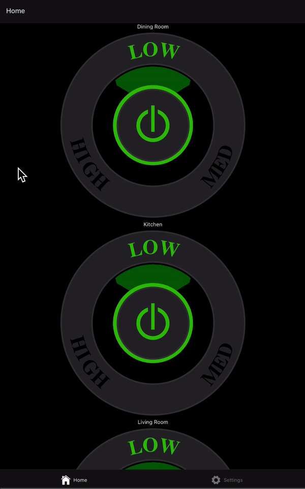

# About

A cool button with react-native. It works on web and it (should) work on android and ios.



# Usage

install expo globally

```
npm install -g expo
```

clone and build

```
git clone https://github.com/rogovski/pwm-demo.git
cd pwm-demo
npm install
npm run web
```
